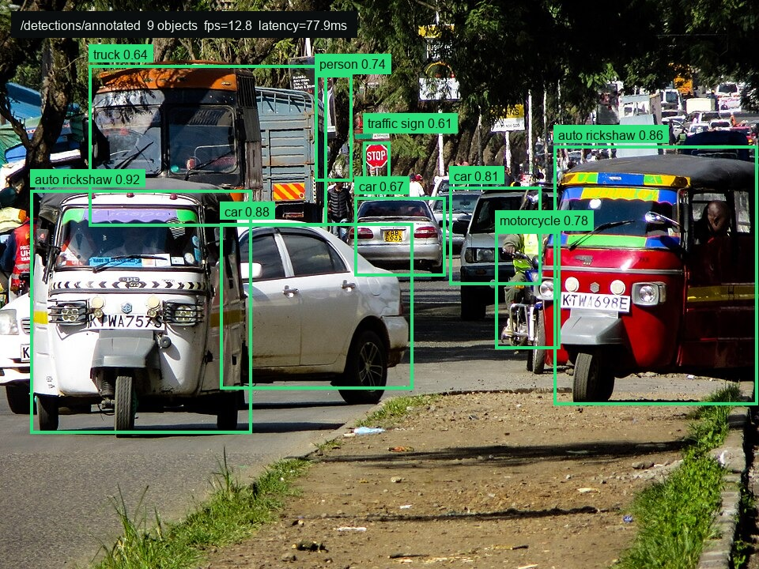
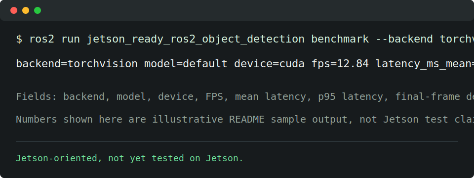

# ROS2 Object Detection Pipeline

Small ROS2 object-detection pipeline for camera streams. It subscribes to camera images, runs a PyTorch detector, publishes `vision_msgs/Detection2DArray` bounding boxes, and publishes an annotated `sensor_msgs/Image` stream.

The package is designed with Jetson deployment in mind, but the current checked-in evidence is a ROS2/PyTorch pipeline plus local benchmark path, not a validated Jetson benchmark.

## Result Screenshots





The screenshots are representative local sample outputs for the README. They are not Jetson benchmark claims. The street-scene photo is based on [“Busy street during rush hour” by Victor Kibiwott](https://commons.wikimedia.org/wiki/File:Busy_street_during_rush_hour.jpg), licensed under [CC BY-SA 4.0](https://creativecommons.org/licenses/by-sa/4.0/), with annotation overlays added.

## What this demonstrates

- A ROS2 Python node that consumes `sensor_msgs/Image` camera frames.
- Detector backend abstraction with `torchvision` Faster R-CNN by default and optional Ultralytics YOLO support.
- Bounding-box publishing through `vision_msgs/Detection2DArray`.
- Annotated image publishing for RViz, `rqt_image_view`, recording, or downstream visualization.
- A repeatable FPS/latency benchmark entry point for CPU, CUDA desktop GPU, or Jetson experiments.
- A Docker build path that keeps ROS2, OpenCV, PyTorch, and the package together.

## Topics

| Direction | Topic | Type |
| --- | --- | --- |
| Subscribe | `/camera/image_raw` | `sensor_msgs/Image` |
| Publish | `/detections` | `vision_msgs/Detection2DArray` |
| Publish | `/detections/annotated` | `sensor_msgs/Image` |
| Publish | `/detections/stats` | `diagnostic_msgs/KeyValue` |

## Quick Start

Install ROS2 Humble or later with `cv_bridge` and `vision_msgs`, then install PyTorch and Torchvision for your machine.

```bash
colcon build --symlink-install
source install/setup.bash
ros2 launch jetson_ready_ros2_object_detection object_detection.launch.py \
  image_topic:=/camera/image_raw \
  backend:=torchvision \
  device:=auto
```

For YOLO:

```bash
pip install ultralytics
ros2 launch jetson_ready_ros2_object_detection object_detection.launch.py \
  backend:=yolo \
  model:=yolov8n.pt
```

View the annotated stream:

```bash
ros2 run rqt_image_view rqt_image_view /detections/annotated
```

## Benchmark

Run repeated inference on a synthetic frame:

```bash
ros2 run jetson_ready_ros2_object_detection benchmark \
  --backend torchvision \
  --device auto \
  --warmup 5 \
  --iterations 50
```

Benchmark an actual image and save JSON:

```bash
ros2 run jetson_ready_ros2_object_detection benchmark \
  --backend yolo \
  --model yolov8n.pt \
  --image captures/frame.jpg \
  --device cuda \
  --json benchmark-results/yolov8n-cuda.json
```

The benchmark reports FPS, mean latency, median latency, p95 latency, frame shape, and the final detection count.

## Docker

Build for a desktop CPU smoke test:

```bash
docker build -t ros2-object-detection:humble .
```

Run with host networking so the container can see ROS graph traffic:

```bash
docker run --rm -it --net=host --ipc=host ros2-object-detection:humble
```

For NVIDIA GPU runtime on a desktop or Jetson:

```bash
docker run --rm -it --net=host --ipc=host --gpus all ros2-object-detection:humble
```

Jetson builds should use PyTorch and Torchvision wheels that match the installed JetPack/L4T release:

```bash
docker build \
  --build-arg TORCH_INSTALL="<jetson-compatible torch torchvision install command>" \
  -t ros2-object-detection:jetson .
```

## Configuration

Defaults live in `config/detector.yaml`. Common launch overrides:

| Parameter | Default | Meaning |
| --- | --- | --- |
| `image_topic` | `/camera/image_raw` | Input camera stream |
| `backend` | `torchvision` | `torchvision` or `yolo` |
| `model` | empty | Torchvision weights selector or YOLO model path |
| `device` | `auto` | `auto`, `cpu`, `cuda`, or `cuda:0` |
| `score_threshold` | `0.5` | Minimum confidence |
| `max_detections` | `50` | Per-frame detection cap |
| `publish_annotated` | `true` | Publish annotated image frames |

## Limitations and next steps

- Jetson deployment is a target, but the repo does not yet include a validated Jetson run or JetPack-specific benchmark.
- First run may download detector weights unless the model files are already cached.
- The default Torchvision model is easy to run but not optimized for Jetson latency.
- No TensorRT export path is included yet; adding ONNX/TensorRT engines is the natural next step.
- No object tracking, temporal smoothing, camera calibration, or 3D projection is included.
- QoS settings are intentionally simple and may need tuning for high-rate cameras.
